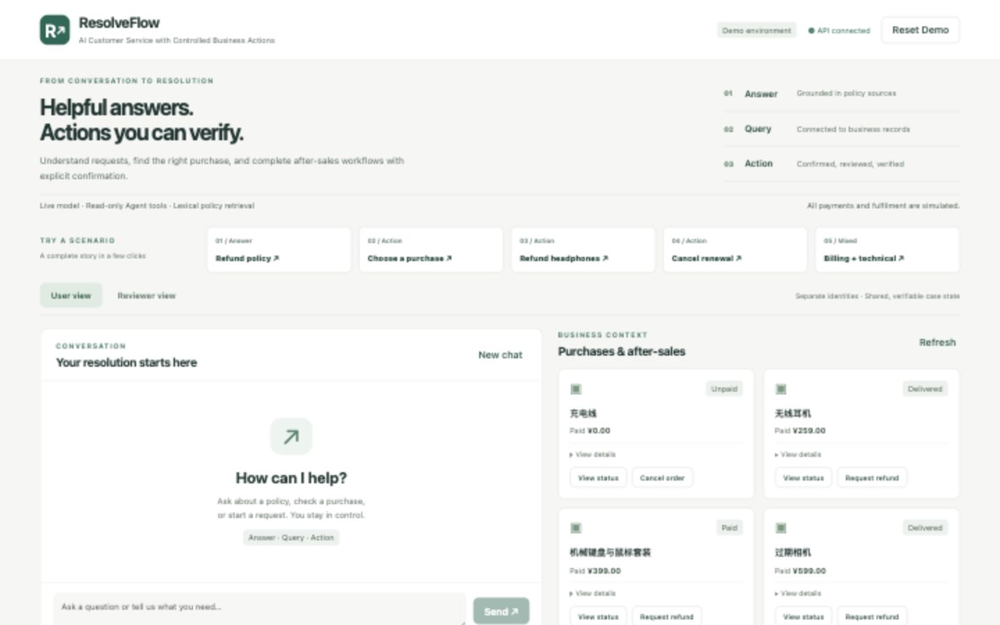
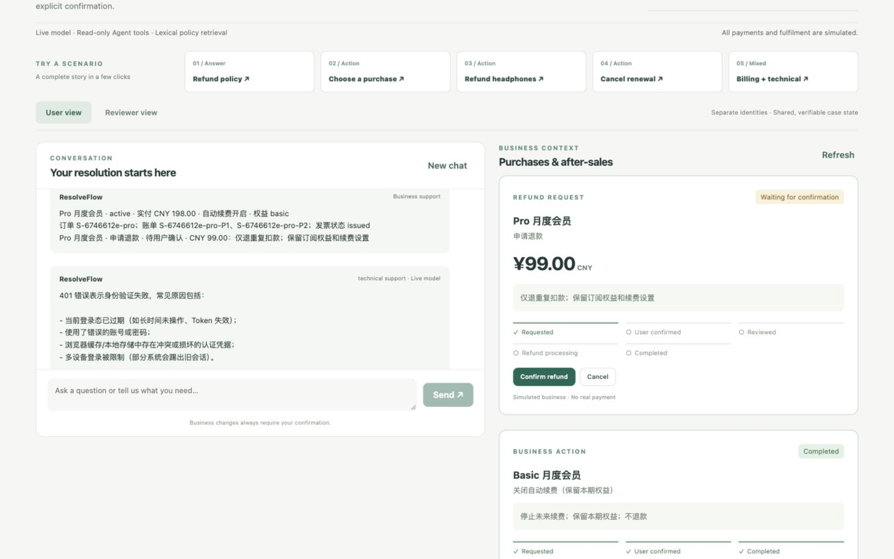
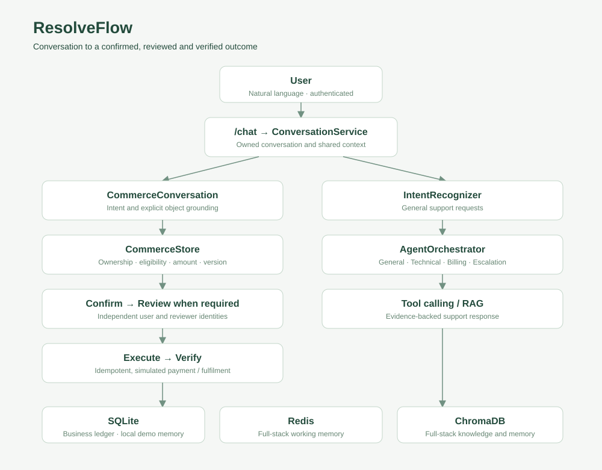

# ResolveFlow

**从客服对话到可核验的业务结果 · AI Customer Service with Controlled Business Actions**

面向售后场景的 AI Agent 应用：回答政策、查询本人购买记录，并通过用户确认、独立审核和状态核验完成退款与停续费闭环。模型负责理解请求，后端业务规则决定金额、资格与执行权限。

[5 分钟演示](docs/demo-script.md) · [产品设计与简历描述](docs/portfolio.md) · [验收证据](docs/validation.md) · [本地运行](docs/local-development.md)

> 本地招聘 Demo 已验收：真实 Qwen Plus、只读工具调用、浏览器业务闭环及移动端布局。支付与履约为 **simulated**；Demo 政策检索为 **BM25 词法检索**。本仓库提供可复现的本地 Demo，尚无公开托管的在线演示。



## 30 秒理解：Answer / Query / Action

| 用户需求 | 实际能力 | 关键约束 |
|---|---|---|
| Answer：商品退款政策是什么？ | 政策回答与可展开来源 | 咨询不创建退款 Case |
| Query：查询我的购买记录 | 商品、订阅、物流、发票和售后状态 | 只访问当前身份的记录 |
| Action：帮我把无线耳机退掉 | ¥259 报价 → 确认 → 独立审核 → 模拟退货与到账 | 金额由 CommerceStore 计算；模型不能授权交易 |

## 一个复合请求，两条处理路径

“把 Pro 会员重复扣的钱退掉，而且登录一直报 401。”

业务路径定位 **¥99 的重复账单**，等待确认；Technical Agent 独立调用错误码工具并返回排查建议。技术回答不替代退款审批，也不代表已修复真实账户。



[查看六个业务步骤与响应式截图](docs/screenshots/README.md)

## 设计重点

- **先消除歧义**：“我要退款”展示八个候选，不替用户挑选对象。
- **分离理解与权限**：LLM 提取意图；CommerceStore 校验归属、资格、金额和状态。
- **确认与审核分离**：user 和 reviewer 使用不同 JWT；用户不能自批退款。
- **可恢复、可追溯**：报价绑定对象和版本；过期需重新确认；重复点击不重复退款，刷新可恢复 Case。
- **明确行为影响**：Basic 停续费保留当前权益，不产生退款；Pro 重复扣款退款保留订阅设置。
- **诚实降级**：无模型时使用离线规则，并明确提示 Technical Agent 不可用。

## 架构与代码入口



`/chat → ConversationService → CommerceConversation → CommerceStore` 是当前业务主链。独立咨询通过 `IntentRecognizer → AgentOrchestrator` 调用专业 Agent 和只读工具。

| 位置 | 用途 |
|---|---|
| [Vue 前端](ResolveFlowFrontend/src/App.vue) | 五个场景、对话、来源和角色切换 |
| [隔离 Demo 服务](ResolveFlow/api/portfolio_demo.py) | 自动身份签发、会话独立 SQLite、模型工具接入 |
| [对话协调](ResolveFlow/agents/conversation_service.py) | 组合业务结果与独立技术咨询 |
| [业务规则](ResolveFlow/business/commerce.py) | 所有权、报价、状态迁移、确认和审核 |
| [Demo 回归测试](ResolveFlow/tests/test_portfolio_demo.py) | 隔离、幂等、停续费和来源边界 |
| [真实模型检查](ResolveFlow/scripts/check_portfolio_live.py) | 显式开启的付费 API 验证，输出脱敏证据 |

技术栈：**Vue 3 · Vite · Python 3.11 · FastAPI · Pydantic · SQLite · JWT · Qwen / OpenAI-compatible API**。
完整后端另含 Redis、ChromaDB 和混合检索组件；它们不属于本次隔离 Demo 的完整验收范围。历史 ActionRuntime 保留兼容与只读追溯，不是当前写入引擎。

## 本地体验

需要 Python **3.11+** 和 Node **20.19+ / 22.12+**。首次安装：

```bash
git clone https://github.com/zhuzhenxiang93-create/ResolveFlow.git
cd ResolveFlow
python3.11 -m venv .venv
.venv/bin/pip install -r ResolveFlow/requirements.txt
npm ci --prefix ResolveFlowFrontend
```

在仓库根目录分别打开两个终端：

```bash
# 终端 1：无需模型密钥的离线模式
AGENT_USE_LLM=0 make portfolio-demo PYTHON="$(pwd)/.venv/bin/python"
```

```bash
# 终端 2
cd ResolveFlowFrontend
VITE_DEMO_MODE=true npm run dev
```

打开 `http://localhost:5173`，自动生成八条购买记录及 User / Reviewer 身份，无需手填 Token。使用 **Reset Demo** 开始新会话，旧审计保留。

[真实模型配置、现有 Mac/Conda 环境与测试命令](docs/local-development.md)。本地工作区可以叫 `Echomind`；以上命令中的 `ResolveFlow/` 子目录始终指 Python 后端。

## 验证结果

2026-09-27 本地验收；以下是内部回归与 smoke checks，不是公开基准或线上指标。

| 检查 | 结果 |
|---|---|
| 后端全套 | 313 项：304 通过、9 跳过、0 失败 |
| Commerce 专项 | 42/42 通过 |
| Demo 专项（已包含在全套中） | 8/8 通过 |
| 真实 Qwen Plus 专项 | 3/3；实际调用错误码与知识检索工具 |
| 浏览器 | 完整退款、刷新恢复、身份切换、来源展开；最终 Console 无错误/警告 |
| 布局与构建 | 1440 / 1024 / 390 / 320px；Vite build 通过 |

9 项跳过为 5 项 Postgres POC 与 4 项 Redis/Chroma 可选依赖测试。详见[完整报告](docs/validation.md)和[脱敏模型证据](docs/live-validation.json)。

## 范围与局限

退款、物流与到账均为模拟；没有生产支付渠道或身份提供方接入。Demo 检索为词法 BM25，不能宣传为已验收的完整混合 RAG。模型输出有不确定性；刷新恢复 Case，不恢复聊天画面。公开部署仍需会话回收、限流和资源控制。

[后端指南](ResolveFlow/README.md) · [前端指南](ResolveFlowFrontend/README.md) · [产品案例与简历用语](docs/portfolio.md)
