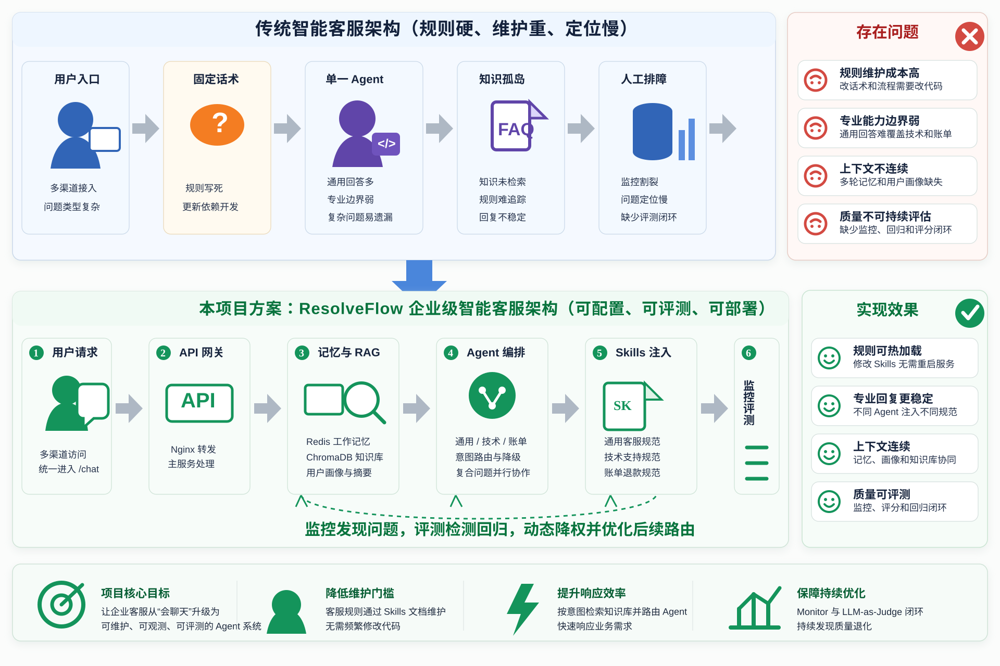
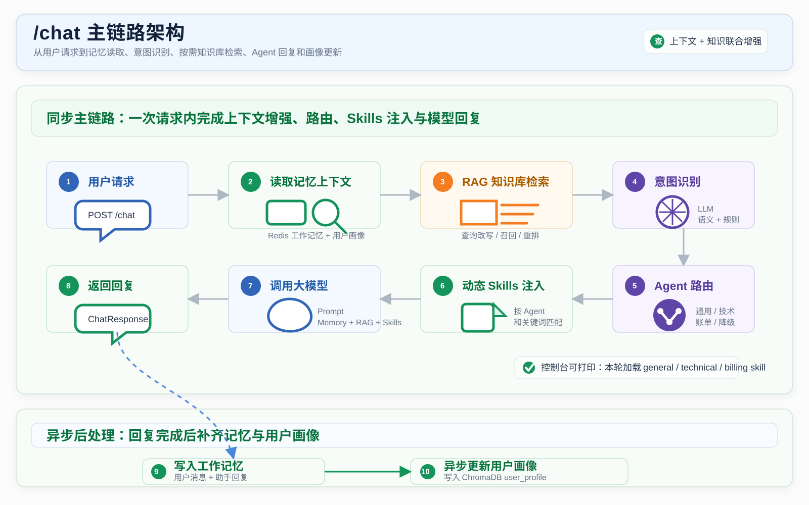
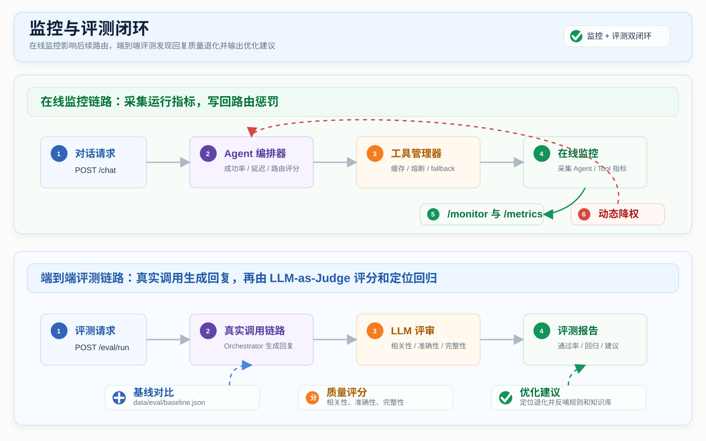
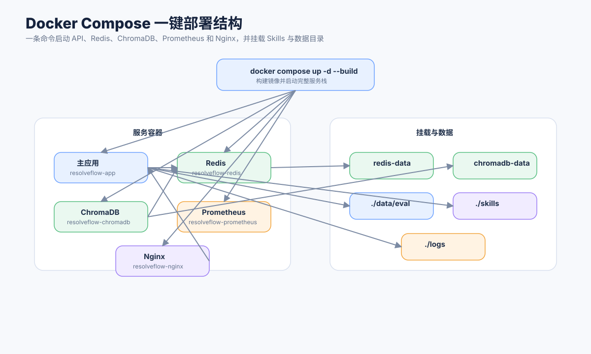

# ResolveFlow 项目架构图

本文档展示 ResolveFlow 的核心架构图。图片均已生成到 `wiki/assets/architecture/`，可直接在 wiki、README 或项目展示材料中引用。

当前架构重点体现：Docker Compose 一键部署、结构化多 Agent 路由、RAG 知识库、三级记忆、动态 Skills、监控和端到端评测。

## 1. 总体架构



说明：

- 用户请求先进入 Nginx，再转发到 ResolveFlow 主服务。
- 主服务提供 `/chat`、`/search`、`/skills`、`/eval/run`、`/monitor`、`/metrics` 等接口。
- Redis 承担工作记忆，ChromaDB 承担 RAG 知识库、情景记忆和用户画像。
- 外部大模型支持 Anthropic Claude 或兼容 Anthropic 协议的 DeepSeek。

## 2. `/chat` 主链路架构



说明：

- `/chat` 会先读取 Redis 和 ChromaDB 中的上下文。
- 系统会按意图决定是否通过 MCP 工具链执行查询改写、并行召回和结果重排。
- Orchestrator 根据意图、关键词和实体计算领域分数，生成包含主 Agent、辅助 Agent 和路由原因的 `RoutingDecision`。
- Agent 调用 LLM 前会通过 SkillManager 注入匹配的动态 Skills。
- 回复完成后，系统写入工作记忆，并异步更新用户画像。

## 3. 多 Agent 与 Skills 注入关系


说明：

- 用户消息先经过 IntentRecognizer，再交给 AgentOrchestrator 生成结构化路由决策。
- GeneralAgent、TechnicalAgent、BillingAgent 分别负责通用客服、技术支持和账单退款。
- 复合问题会形成 `primary_agent + supporting_agents`，并行处理后按主处理和辅助处理合并回复。
- 三类 Agent 分别加载自己的 Skills：
  - 通用客服接待规范
  - 技术支持处理规范
  - 账单退款处理规范
- Skills 根据 `agents` 和 `keywords` 匹配，避免不同领域规则互相污染。

## 4. 数据与存储架构


说明：

- Redis 保存当前会话最近消息和短期工作记忆。
- ChromaDB 包含三个核心 collection：
  - `knowledge_base`：RAG 知识库
  - `episodic`：历史会话摘要
  - `user_profile`：用户画像
- `skills/*/SKILL.md` 是可热加载的客服规范。
- `data/eval/baseline.json` 保存端到端评测基线。

## 5. 监控与评测闭环



说明：

- `/monitor` 读取 Agent 和工具统计，包括成功率、平均延迟和熔断状态。
- Monitor 会计算 `monitor_penalty`，写回 Orchestrator，影响后续路由评分。
- `/eval/run` 会真实调用 Orchestrator 生成回复，再用 LLM-as-Judge 评分。
- 评测输出通过率、分数、回归问题和优化建议。

## 6. 一键部署结构



说明：

- 一条命令即可启动完整服务栈：

```bash
docker compose up -d --build
```

- Compose 会启动：
  - `resolveflow-app`
  - `resolveflow-redis`
  - `resolveflow-chromadb`
  - `resolveflow-prometheus`
  - `resolveflow-nginx`
- 项目会挂载 `./skills`、`./data/eval` 和 `./logs`，方便热加载规则、保存评测基线和查看日志。
